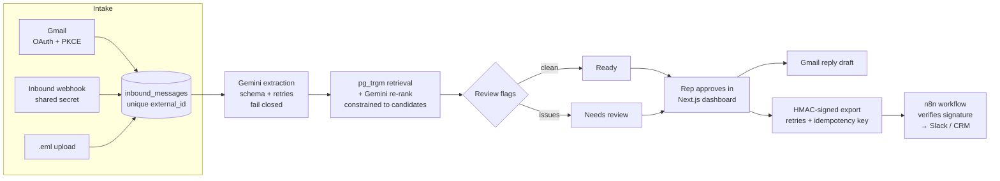

# RFQ Desk

**RFQ emails and PDFs in, reviewed quotes out.**

Industrial distributors get requests for quote (RFQs) as emails, PDFs and phone-scan attachments.
A sales rep retypes every line into the ERP, looks up part numbers, prices it and writes the reply,
and that takes 15–30 minutes per RFQ. RFQ Desk does the reading, matching and drafting, and leaves
the decisions to the rep:

1. **Intake:** from a connected Gmail inbox (OAuth), an inbound-email webhook (mail provider, n8n, Make), or an `.eml` upload. Every path is idempotent.
2. **Extraction:** Gemini (Vertex AI) reads the email body and PDF/image attachments into a strict JSON schema, including a confidence score for every line.
3. **Catalog matching:** Postgres `pg_trgm` retrieves the top candidates for each line, and exact SKUs are accepted directly. For everything else, Gemini **re-ranks** the candidates, checking attributes like size, thread, HP and pack size. It may only pick a SKU that retrieval returned, or none, and it has to give a one-line reason.
4. **Review gating:** missing fields, low confidence, ambiguous or unmatched lines, sender mismatches and **prompt-injection attempts** all send the RFQ to a human, with the reason shown.
5. **Approval:** the rep edits and approves. Prices come from the catalog or from the rep, never from the model. On approval the system writes a quote reply (saved as a threaded **Gmail draft**) and sends a **signed, retried, idempotent webhook** to downstream systems (n8n → Slack/CRM/ERP).
6. **Audit trail:** every AI proposal and every human edit is recorded in an append-only log.



## Stack

| Layer | Choice |
| --- | --- |
| API | Python 3.13, FastAPI, SQLAlchemy 2, Pydantic |
| Data | PostgreSQL 16 + `pg_trgm` |
| AI | Gemini via `google-genai` (Vertex AI service account or API key), structured output |
| Integrations | Gmail API (OAuth 2.0 + PKCE, Fernet-encrypted tokens), inbound/outbound webhooks, n8n |
| UI | Next.js 16 (App Router), React 19, Tailwind 4 |
| Quality | pytest (35 tests against real Postgres), golden-set extraction eval, ruff, ESLint |
| Delivery | Docker, docker compose, GitHub Actions CI |

## Run it locally

Prerequisites: Docker, [uv](https://docs.astral.sh/uv/), Node 24 + pnpm.

```bash
docker compose up -d db n8n                  # Postgres on :5434, n8n on :5678

cd backend
cp .env.example .env                         # fill in GCP project (see "Credentials")
uv sync
uv run python -m app.seed                    # demo catalog: 33 products, 3 sales reps
uv run uvicorn app.main:app --reload         # API on :8000  (docs at /docs)

cd ../frontend
pnpm install
pnpm dev --port 3001                         # dashboard on :3001
```

Load the six sample RFQs (clean PDF, informal email, messy part numbers, prompt injection,
an invoice that isn't an RFQ, and a skewed phone scan):

```bash
cd backend
uv run python -m scripts.send_samples        # via the inbound webhook
# or upload files from samples/eml/ in the dashboard
```

Full stack in containers: `docker compose --profile full up --build`.

### Credentials

Everything under `secrets/` and `.env` is gitignored.

**Gemini on Vertex AI:** enable the Vertex AI API, give a service account `roles/aiplatform.user`,
save its key as `secrets/gcp-sa.json`, and set `GCP_PROJECT` / `GCP_LOCATION`. (Or set
`GEMINI_BACKEND=api_key` and `GEMINI_API_KEY`.)

**Gmail:** enable the Gmail API, create an OAuth client of type *Web application* with the redirect URI
`http://localhost:8000/api/gmail/oauth/callback`, save it as `secrets/gmail-oauth-client.json`,
add your address as a test user, and generate a token encryption key:

```bash
uv run python -c "from cryptography.fernet import Fernet; print(Fernet.generate_key().decode())"
```

**n8n export receiver:**

```bash
docker compose exec n8n n8n import:workflow --input=/workflows/rfq-approved-workflow.json
docker compose exec n8n n8n publish:workflow --id=rfqDeskExport001 && docker compose restart n8n
```

## Tests and evals

```bash
cd backend
uv run pytest -q              # unit + API tests on a real Postgres; Gemini is stubbed
uv run python -m evals.run_eval   # real Gemini against the golden set; exits 1 if a quality gate fails
```

The tests cover the failure modes that matter in production: duplicate webhook deliveries are processed
exactly once; forged or replayed signatures are rejected; a prompt-injection attempt cannot change prices;
an unmatched line blocks approval until a human fixes it; extraction failure fails closed; approved
quotes are locked; exports retry on 5xx but not on 4xx and are never sent twice.

The **eval** (`backend/evals/`) runs the real extractor and matcher on every sample email and scores
line-level precision and recall on (SKU, quantity), header accuracy, `is_rfq` accuracy and injection detection
against hand-written golden files. It gates on `line_f1 ≥ 0.85`, perfect `is_rfq` accuracy, 100% injection
recall and zero false positives. Each run records the model and a hash of the system prompt, so a prompt
change can be compared against the previous run. In CI it runs on demand (`workflow_dispatch`) because it
calls a paid API.

**What the eval caught.** The first version matched on trigram similarity alone. Extraction was already
correct (every quantity, date and email right), but line F1 was **0.57**: scores for text like
`1/2-13 x 2" grade 8` or `gloves A4 size L` were too close together to auto-select, and the gloves case
couldn't tell size L from size M. Lowering thresholds would have been tuning to six samples. Instead, SQL
now retrieves candidates and Gemini re-ranks them under constraints, which brought line F1 to **1.00** on
`gemini-2.5-flash` with everything else unchanged. With six cases this is a regression gate, not a
benchmark; the next step is real RFQs. The cost is one extra model call per RFQ, and median latency went
from ~8s to ~17s.

## Design decisions

- **Humans own money and outbound communication.** The model never sets a price, sends an email or triggers an export. It proposes, and `approve_rfq` checks the invariants (catalog product, positive quantity, price, valid email) under a row lock.
- **Untrusted input is data.** Email and PDF text is marked as untrusted in the system prompt, the model has to *report* instruction-like text (`suspicious_instructions`), and that evidence forces human review. Even if the model were fooled, it has no tool that can change prices.
- **Idempotency everywhere it can go wrong:** a unique `external_id` with `INSERT … ON CONFLICT DO NOTHING` at intake, `SELECT … FOR UPDATE` on state transitions, and a unique idempotency key per outbound delivery.
- **Retrieve in SQL, re-rank with the model, on a short leash.** Postgres gives recall cheaply and deterministically, and exact SKUs never reach the model. The re-ranker can only choose among retrieved candidates (anything else fails closed to "no match"), must reach 0.8 confidence to auto-select, and records its reason on the line. If it's down, matching falls back to SQL-only rules and more lines go to review.
- **Background work is plain functions with their own DB session** (`run_processing`, `run_post_approval`). They run in FastAPI `BackgroundTasks` today and can move to Celery or Cloud Tasks without changes.

## Status and next steps

- [x] Intake (Gmail OAuth, webhook, upload), extraction, matching, review UI, approval, Gmail drafts, signed export, n8n receiver
- [x] Tests, golden-set eval, Docker images, CI
- [ ] Deploy: Cloud Run (API + web) + Cloud SQL, secrets in Secret Manager, Gmail push via Pub/Sub instead of manual sync
- [ ] Dashboard auth (Google SSO) and per-rep permissions; the reviewer identity is currently a header
- [ ] Alembic migrations (the schema is currently created at startup)
- [ ] Durable job queue with retry and dead-letter handling for extraction

All sample companies, people and data are fictional.
